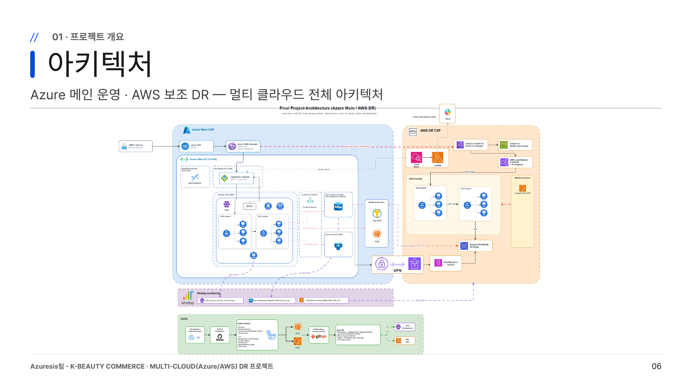

# 박수현 | Cloud Engineer Portfolio

> **애플리케이션 구조를 이해하고, 인프라 운영 관점에서 문제를 해결하는 클라우드 엔지니어 지원자**

Java/Spring 기반 웹 개발 교육과 프로젝트 운영 경험을 바탕으로, 클라우드 인프라·DevOps 영역으로 역량을 확장하고 있습니다.  
단순히 인프라를 구축하는 것에 그치지 않고, **애플리케이션 동작 방식·데이터 흐름·배포 구조**를 함께 고려하여 안정적인 서비스 운영 환경을 설계하는 데 강점이 있습니다.

<!-- 공개용 README에는 연락처, 주소, 생년월일, 실제 계정 ID, Secret, 도메인 관리 정보 등을 기재하지 않습니다. -->

---

## 1. Core Competency

| 역량 | 설명 |
|---|---|
| **Cloud Architecture** | Azure/AWS 기반 3-Tier, 고가용성, 멀티클라우드 DR 아키텍처 설계 및 구현 |
| **Kubernetes Operation** | AKS/EKS 환경에서 Web/WAS 컨테이너 배포, Service, Ingress, Probe, HPA 구성 경험 |
| **IaC** | Terraform 모듈화, Remote State, 환경 변수·Secret 분리 기반 인프라 코드화 경험 |
| **CI/CD & GitOps** | GitHub Actions와 ArgoCD를 활용한 이미지 빌드·레지스트리 Push·GitOps 배포 흐름 구성 |
| **Troubleshooting** | DB Failover, 세션 유지, Secret 주입, 배포/인증 오류 등 운영 이슈 원인 분석 및 해결 |
| **Application Understanding** | Java/Spring, DB, WAS, 배포 흐름 이해를 기반으로 애플리케이션과 인프라 사이의 문제를 함께 분석 |

---

## 2. Tech Stack

| Category | Skills | Experience |
|---|---|---|
| **Cloud** | Azure, AWS | Azure 메인 운영 환경, AWS 보조 DR 환경 구성 |
| **Compute / Network** | VMSS, Application Gateway, Traffic Manager, VNet, VPC, Subnet, NSG | 3-Tier 네트워크, L7 라우팅, 장애 전환 구조 설계 |
| **Container** | Docker, Kubernetes, AKS, EKS | Web/WAS 컨테이너 배포, Service/Ingress 구성 |
| **IaC** | Terraform | Azure 인프라 모듈화, Remote State, Secret 분리 |
| **CI/CD** | GitHub Actions, ArgoCD | Docker Image Build, ACR/ECR Push, GitOps 배포 |
| **DB / Cache** | MySQL, Azure Database for MySQL, AWS RDS, Redis | DB Failover 검증, Redis 세션 외부화 |
| **Monitoring** | Grafana, WhaTap, Slack Alert | 부하 테스트, 주요 지표 모니터링, 알림 연동 |
| **Language / Framework** | Java, Spring Boot, JSP/Servlet, JavaScript, Python | 웹 애플리케이션 구조 및 백엔드 흐름 이해 |

---

## 3. Project Summary

| No | Project | Type | Key Point |
|---|---|---|---|
| 01 | [Multi-Cloud DR 기반 K-Beauty Commerce Platform](#project-01-multi-cloud-dr-기반-k-beauty-commerce-platform) | Team | Azure 메인 + AWS DR, Terraform, AKS/EKS, CI/CD, Redis, HTTPS |
| 02 | [AWS EKS 기반 3-Tier Container Service](#project-02-aws-eks-기반-3-tier-container-service) | Personal | EKS, ECR, RDS, Bastion, Secret, Deployment/Service/Ingress |
| 03 | [Azure 기반 고가용성 Web Infrastructure](#project-03-azure-기반-고가용성-web-infrastructure) | Team | VMSS, Application Gateway, Auto Scaling, Multi-AZ, DB Failover |

---

# Project 01. Multi-Cloud DR 기반 K-Beauty Commerce Platform

## 프로젝트 개요

Azure를 메인 운영 환경으로, AWS를 보조 DR 환경으로 구성한 **멀티클라우드 기반 K-Beauty 커머스 서비스 운영 프로젝트**입니다.  
단일 클라우드 장애 시 서비스 전체가 중단될 수 있는 SPOF 문제를 해결하기 위해, Azure 장애 발생 시 AWS 보조 환경으로 전환 가능한 DR 구조를 설계했습니다.

- **기간**: 2026.06.01 ~ 2026.07.01
- **팀 규모**: 3인
- **담당 역할**: Azure CSP · 인프라/운영/배포
- **핵심 키워드**: Multi-Cloud DR, Azure, AWS, Terraform, AKS, EKS, GitHub Actions, ArgoCD, Redis, HTTPS

## Architecture

> 아키텍처 이미지를 추가하세요.

```markdown

```

### 전체 흐름

```text
Client
  → DNS / Traffic Manager
  → Azure Application Gateway
  → AKS Web/WAS
  → Azure Database for MySQL / Redis / Key Vault

Azure 장애 발생 시
  → Traffic Manager Failover
  → AWS DR Endpoint
  → CloudFront / EKS Web/WAS
  → AWS RDS
```

## 담당 업무

- K-Beauty 홈페이지 설계 및 구현
- Terraform 기반 Azure 인프라 구현
- Kubernetes Blue/Green + Canary 배포 구조 설계
- Redis 기반 세션 외부화 구성
- GitHub Actions + ArgoCD 기반 CI/CD 구성
- HTTPS 인증서 적용 및 만료 알림 구현

## 기술 선택 이유

### Multi-Cloud DR

단일 클라우드 장애 시 전체 서비스가 중단되는 위험을 줄이기 위해 Azure를 메인 운영 환경으로 두고, AWS를 보조 DR 환경으로 구성했습니다. 커머스 서비스는 주문·결제 흐름이 중요하기 때문에 서비스 연속성과 데이터 보호를 핵심 목표로 설정했습니다.

### Terraform

인프라를 수동으로 구성하면 환경 재현성이 낮고, 팀원 간 설정 차이가 발생할 수 있습니다. Terraform을 사용해 네트워크, AKS, ACR, DB, Redis, Key Vault, Traffic Manager 등을 코드로 관리하고, Remote State를 사용해 팀 단위 인프라 상태를 공유했습니다.

### Blue/Green + Canary

운영 중 배포 리스크를 줄이기 위해 Blue/Green 구조를 적용했습니다. 일반 사용자는 현재 운영 중인 color로 라우팅하고, `/canary` 경로로 신규 버전을 먼저 검증한 뒤 Service selector를 전환하는 방식으로 무중단 배포와 빠른 롤백을 가능하게 했습니다.

### Redis Session Externalization

Pod가 재시작되거나 트래픽이 다른 Pod로 분산될 때 세션이 끊기는 문제를 방지하기 위해 HttpSession을 Redis로 외부화했습니다. 이를 통해 Pod 변경 이후에도 로그인 세션이 유지되는 구조를 검증했습니다.

## 구현 내용

### Terraform IaC

```text
infra/
├── main.tf
├── provider.tf
├── terraform.tfvars
├── .env                  # Git 제외
└── modules/azure/
    ├── network
    ├── aks
    ├── acr
    ├── agw
    ├── db
    ├── redis
    ├── keyvault
    ├── rbac
    ├── traffic_manager
    ├── dns
    └── vpn
```

### Kubernetes Deployment Strategy

```text
/        → web-active Service → blue 또는 green Deployment
/canary  → web-green Service  → 신규 버전 검증
```

- readinessProbe로 준비된 Pod에만 트래픽 전달
- livenessProbe로 비정상 컨테이너 자동 재시작
- HPA로 CPU 기준 자동 확장
- selector 전환 방식으로 배포 및 롤백 단순화

### CI/CD Flow

```text
Code Push / PR
  → GitHub Actions
  → Build & Test
  → Docker Image Build
  → Security Scan
  → ACR/ECR Push
  → GitOps Repository Image Tag Update
  → ArgoCD Sync
  → AKS/EKS Deploy
```

## Trouble Shooting

### 1) Redis 세션 유지 검증

**문제**  
기본 Pod 메모리 세션을 사용할 경우 요청이 다른 Pod로 분산되면 로그인 세션이 유지되지 않는 문제가 발생할 수 있었습니다.

**원인**  
세션 정보가 각 WAS Pod의 메모리에 저장되어 Pod 간 공유되지 않았습니다.

**해결**  
Spring Session 설정을 Redis로 변경하고, Redis 접속 정보는 Azure Key Vault와 External Secrets Operator를 통해 Kubernetes Secret으로 주입했습니다.

**결과**  
여러 번 요청이 들어가도 동일한 세션 상태가 유지되는 것을 검증했습니다.

## 결과 및 회고

- Azure-AWS 이중화 기반의 DR 구조를 직접 설계하며 서비스 연속성 관점의 아키텍처를 이해했습니다.
- Terraform, Kubernetes, CI/CD, Redis, HTTPS를 개별 기술이 아닌 운영 흐름으로 연결해 구현했습니다.
- 애플리케이션 세션, Secret 주입, 배포 전략처럼 운영 중 장애로 이어질 수 있는 요소를 사전에 고려하는 경험을 했습니다.

---

# Project 02. AWS EKS 기반 3-Tier Container Service

## 프로젝트 개요

AWS EKS를 활용해 Web/WAS/DB 구조의 3-Tier 서비스를 컨테이너 기반으로 배포하고 운영한 개인 프로젝트입니다.  
RDS, ECR, EKS, Bastion, Kubernetes Secret, Deployment, Service, Ingress를 직접 구성하며 컨테이너 기반 서비스 운영 흐름을 학습했습니다.

- **기간**: 2026.05
- **유형**: 개인 프로젝트
- **핵심 키워드**: AWS, EKS, ECR, RDS, Kubernetes, Secret, Nginx Ingress Controller

## Architecture

```markdown

```

### 전체 흐름

```text
Client
  → NLB
  → Nginx Ingress Controller
  → Web Service / WAS Service
  → WAS Pod
  → AWS RDS MySQL
```

## 구현 내용

### AWS RDS

- MySQL 기반 RDS 구성
- Multi-AZ 적용
- Public Access 비활성화
- Bastion 및 EKS Cluster 보안 그룹에서만 3306 접근 허용

### ECR

- Frontend와 Backend 이미지를 분리해 Private ECR Repository 구성
- AWS 계정 인증 기반 Pull 구조 적용
- EKS와 IAM 기반으로 자연스럽게 연동되도록 구성

### EKS

- EKS Cluster 생성
- Public/Private Subnet 구성
- Bastion Server에서 kubectl 접근 환경 구성
- Cluster Access Management로 접근 권한 설정

### Kubernetes

- Namespace 분리
- DB 접속 정보는 Kubernetes Secret으로 관리
- WAS Deployment와 ClusterIP Service 구성
- Web Deployment, Service, Ingress 구성
- Nginx Ingress Controller를 Helm으로 설치하고 AWS NLB와 연동

## Trouble Shooting

### Docker Commit 방식의 한계

**문제**  
초기에는 `docker commit` 방식으로 이미지를 만들었으나, 컨테이너 실행 시마다 설치 스크립트가 반복 실행되는 문제가 있었습니다.

**원인**  
실행 환경과 빌드 과정이 명확히 분리되지 않았고, 이미지 생성 과정이 재현 가능하지 않았습니다.

**해결**  
Dockerfile과 Multi-stage build를 적용해 Build 단계와 Runtime 단계를 분리했습니다.

**결과**  
컨테이너 실행 시 불필요한 설치 과정이 제거되었고, 이미지 구성 과정이 명확해졌습니다.

## 결과 및 회고

- EKS 클러스터 접근, Private ECR 연동, Kubernetes Secret 주입, Deployment/Service 배포 흐름을 직접 구성했습니다.
- 컨테이너 이미지는 단순히 실행 결과를 저장하는 것이 아니라, 재현 가능하고 보안상 안전하게 관리되어야 한다는 점을 학습했습니다.
- 향후에는 Terraform으로 EKS, RDS, ECR, IAM 구성을 코드화해 재현성을 높이고 싶습니다.

---

# Project 03. Azure 기반 고가용성 Web Infrastructure

## 프로젝트 개요

Azure를 활용해 트래픽 증가 상황에서도 안정적으로 운영 가능한 **Auto Scaling 및 Multi-AZ 기반 3-Tier 웹 서비스 인프라**를 구축한 팀 프로젝트입니다.

- **기간**: 2026.03.27 ~ 2026.04.10
- **팀 규모**: 3인
- **담당 역할**: WAS Tier
- **핵심 키워드**: Azure, VMSS, Application Gateway, Auto Scaling, Multi-AZ, Azure Database for MySQL, Tomcat, Grafana, nGrinder

## Architecture

```markdown

```

### 전체 흐름

```text
Client
  → DNS
  → Public Application Gateway
  → Web VMSS
  → Internal Application Gateway
  → WAS VMSS
  → Azure Database for MySQL
```

## 담당 업무

- WAS Tier 구성
- Application Gateway 설정
- VMSS 구현
- Tomcat 설정
- 코드 리팩토링
- 모니터링 및 경보 체계 구축
- 부하 테스트 수행

## 기술 선택 이유

### VMSS Auto Scaling

이벤트성 트래픽 증가 상황에서도 서비스가 중단되지 않도록 VMSS 기반 Auto Scaling을 적용했습니다. 평상시에는 최소 인스턴스를 유지하고, 부하 발생 시 자동 확장하여 안정성과 비용 효율성을 함께 고려했습니다.

### Application Gateway

Web Tier와 WAS Tier 앞단에 Application Gateway를 배치해 L7 라우팅과 트래픽 분산을 구성했습니다. Public AGW와 Internal AGW를 분리해 외부 접근 구간과 내부 WAS 접근 구간을 나눴습니다.

### Multi-AZ

장애 격리와 서비스 연속성을 위해 Zone을 분리하여 VMSS와 DB 가용성을 확보했습니다.

## Trouble Shooting: DB Failover 후 Connection 갱신 문제

**문제**  
DB Failover 테스트 중 DB Zone이 변경되었지만, 애플리케이션 화면에서 DB Host 정보가 갱신되지 않는 문제가 발생했습니다.

**원인 분석**  
`nslookup`으로 DB DNS가 변경된 것은 확인했지만, 애플리케이션의 기존 Connection 객체가 유지되면서 새 DB 연결 정보를 반영하지 못하는 상황이었습니다.

**해결 과정**  
서버에서 시스템 정보를 다시 받아와 Redeploy하는 방식도 고려했지만, 자동화 스크립트와 운영 부담이 커질 수 있다고 판단했습니다.  
대신 애플리케이션의 DataSource 설정을 수정해 Connection 객체 문제가 발생했을 때 다시 생성될 수 있도록 개선했습니다.

**결과**  
DB Failover 이후에도 DB Host 정보가 정상적으로 출력되었고, 인프라 장애 상황에서도 애플리케이션 연결이 갱신될 수 있음을 검증했습니다.

## 결과 및 회고

- 클라우드 운영에서는 인프라 고가용성뿐 아니라 애플리케이션의 연결 관리 방식도 함께 고려해야 한다는 점을 배웠습니다.
- 개발 경험을 기반으로 단순 인프라 문제가 아닌 워크로드 관점의 원인을 분석할 수 있었습니다.
- 이후 프로젝트에서는 Redis 세션 외부화, Key Vault Secret 주입, CI/CD 배포 전략 등 운영 안정성을 높이는 구조를 더 적극적으로 고려하게 되었습니다.

---

## 4. Troubleshooting Archive

| Issue | Summary | Link |
|---|---|---|
| DB Failover Connection 갱신 문제 | DB DNS는 변경되었지만 애플리케이션 Connection 객체가 기존 연결을 유지한 문제 해결 | `./troubleshooting/db-failover.md` |
| Redis Session 유지 문제 | Pod 변경 시 로그인 세션 유지를 위해 Redis 세션 외부화 적용 | `./troubleshooting/redis-session.md` |
| Terraform 인증 차이 문제 | Local apply와 CI/CD apply의 인증 주체 차이로 인한 오류 분석 | `./troubleshooting/terraform-auth.md` |
| Key Vault Secret 주입 문제 | External Secrets Operator와 Key Vault 연동 과정의 Secret 동기화 문제 분석 | `./troubleshooting/keyvault-secret.md` |

---

## 5. Education & Certification

### Training

- **AI MSP 베스핀글로벌 멀티클라우드 엔지니어 부트캠프**  
  AWS, Azure, Docker, Kubernetes, Terraform, CI/CD, DR Architecture

- **빅데이터 분석서비스 개발자 과정**  
  Java, Python, JSP/Servlet, Spring, Database, Linux, AWS EC2 배포

### Certification

- 정보처리기사

---

## 6. Career Background

5년간 IT 교육기관에서 Java, Spring, Database, Web, Git/GitHub, Linux, AWS EC2 배포 등을 강의하고 프로젝트를 지도했습니다.  
이 과정에서 애플리케이션 구조, 데이터 흐름, 배포 과정, 교육생 프로젝트 운영을 경험했으며, 이후 클라우드 인프라와 DevOps 영역으로 역량을 확장했습니다.

이전 경력은 단순 강의 경험이 아니라, 클라우드 엔지니어에게 필요한 다음 역량으로 연결됩니다.

- 애플리케이션 구조 이해
- 문제를 설명하고 문서화하는 능력
- 팀 프로젝트 관리 및 협업 경험
- DB, WAS, 배포 흐름에 대한 이해
- 장애 상황을 단계적으로 분석하는 습관

---

## 7. Portfolio Links

> 실제 GitHub에 올릴 때 아래 링크를 교체하세요.

| Type | Link |
|---|---|
| GitHub | `https://github.com/your-github-id` |
| Portfolio Page | `https://your-github-id.github.io/cloud-engineer-portfolio/` |
| Main Repository | `https://github.com/your-github-id/cloud-engineer-portfolio` |
| Blog / Notes | `https://your-blog-url` |

---

## 8. Security Notice

본 포트폴리오에는 다음 정보를 포함하지 않습니다.

- 실제 계정 ID
- Access Key / Secret Key
- DB Password
- 실사용 중인 도메인 관리 정보
- 개인 연락처, 주소, 생년월일
- 외부에 공개하면 안 되는 인프라 상세 값

---

## 9. README 작성 기준

이 포트폴리오는 단순 기술 나열이 아니라 다음 기준으로 작성했습니다.

```text
1. 무엇을 만들었는가
2. 왜 이 기술을 선택했는가
3. 내가 어떤 역할을 했는가
4. 어떤 문제를 만났고 어떻게 해결했는가
5. 결과적으로 무엇이 달라졌는가
```

---

## 10. Next Step

- [ ] 프로젝트별 상세 README 분리
- [ ] 아키텍처 이미지 추가
- [ ] GitHub Pages 배포
- [ ] PDF 제출본 변환
- [ ] 트러블슈팅 문서 상세화
- [ ] 실제 코드 Repository 링크 연결

