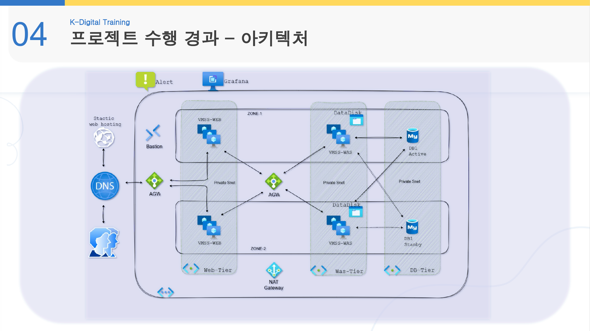

<link rel="stylesheet" href="../assets/style.css">

Project 03

<a href="../index.html">Home</a>

<main class="shell">
<section class="hero">
  
TEAM PROJECT · AZURE HA

  <h1>Azure 기반 고가용성 Web Infrastructure</h1>
  
Auto Scaling 및 Multi-AZ 기반 3-Tier 웹 서비스 인프라를 구축하고, 부하 테스트와 DB Failover를 통해 서비스 안정성을 검증한 프로젝트입니다.

</section>

<section class="color-block mint">
  
PROJECT OVERVIEW

  <h2 class="section-title">트래픽 급증에도 중단 없는 3-Tier Web Service</h2>
  
Client → DNS → Public Application Gateway → Web VMSS → Internal Application Gateway → WAS VMSS → Azure MySQL

</section>

<section class="section"><h2 class="section-title">Architecture</h2>

</section>

<section class="section">
  <h2 class="section-title">My Role · WAS Tier</h2>
  

    
<h3>Application Gateway</h3>
Public/Internal AGW 라우팅을 구성해 Web/WAS 계층 간 요청 흐름을 설계했습니다.

    
<h3>VMSS</h3>
WAS VMSS를 구성하고 Auto Scaling 정책을 통해 트래픽 대응 구조를 구현했습니다.

    
<h3>Tomcat</h3>
Tomcat 환경 구성, 애플리케이션 배포, DB 접속 정보 주입 구조를 구성했습니다.

    
<h3>Monitoring</h3>
부하 테스트와 모니터링 지표를 확인하며 WAS 병목과 확장 필요성을 분석했습니다.

    
<h3>Failover</h3>
DB Failover 이후 애플리케이션 연결 갱신 문제를 분석하고 해결했습니다.

    
<h3>Documentation</h3>
문제 원인과 해결 과정을 STAR 구조로 정리해 면접 답변형 경험으로 문서화했습니다.

  

</section>

<section class="color-block navy">
  
TROUBLESHOOTING

  <h2 class="section-title">DB Failover 후 Connection 객체 갱신 문제</h2>
  
DB DNS는 변경되었지만 애플리케이션 Connection 객체가 기존 연결을 유지해 DB Host 정보가 갱신되지 않는 문제가 발생했습니다.

  
<a class="btn btn-secondary" href="../troubleshooting/db-failover.html">DB Failover 문서 보기</a>

</section>

<footer class="footer">BACK TO <a href="../index.html">PORTFOLIO HOME</a></footer>
</main>
