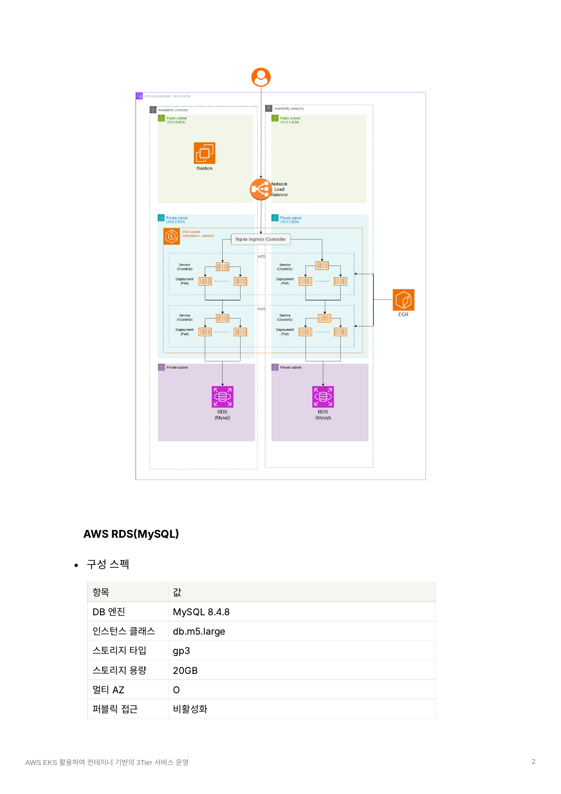

# AWS EKS 활용하여 컨테이너 기반의 3-Tier 서비스 운영

> 쿠버네티스 관리형 서비스(EKS) 기반 컨테이너 3-Tier 웹 서비스 운영 (개인 프로젝트)
> EKS 기술을 스스로 학습·운영하며   컨테이너와 MSA 환경을 체득하기 위한 프로젝트

---

## 📌 프로젝트 개요

PetClinic 애플리케이션을 **컨테이너 기반 3-Tier(WEB/WAS/DB)** 구조로 AWS EKS 위에 배포·운영한 개인 프로젝트입니다. 멀티 스테이지 Dockerfile로 이미지를 경량화하고, ECR·Secret·Ingress를 활용해 실서비스에 가까운 컨테이너 운영 환경을 직접 구성했습니다.

- **주제**: 쿠버네티스 관리형 서비스(EKS) 운영하기
- **목표**: 컨테이너 기반 MSA 서비스를 스스로 학습·운영하여 컨테이너/MSA 환경 숙지
- **트래픽 흐름**: `Client → NLB → ingress-nginx (L7) → web-svc(Nginx) → was-svc(Tomcat) → RDS(MySQL)`
- **구분**: 개인 프로젝트 (발표자료)

---

## 🛠 기술 스택

<table>
  <tr>
    <td>운영체제</td>
    <td>
      
      
      
    </td>
  </tr>
  <tr>
    <td>클라우드</td>
    <td>
      
      
      
      
      
    </td>
  </tr>
  <tr>
    <td>컨테이너</td>
    <td>
      
      
      
    </td>
  </tr>
  <tr>
    <td>서버환경</td>
    <td>
      
      
      
      
    </td>
  </tr>
  <tr>
    <td>언어 &빌드</td>
    <td>
      
      
      
    </td>
  </tr>
  <tr>
    <td>프레임워크</td>
    <td>
      
    </td>
  </tr>
  <tr>
    <td>데이터베이스</td>
    <td>
      
    </td>
  </tr>
  <tr>
    <td>도구</td>
    <td>
      
      
      
    </td>
  </tr>
</table>

---

## 🏗 아키텍처

  

> Multi-AZ(ap-northeast-2a / 2c) 구성으로 Public/Private Subnet을 분리하고, EKS 클러스터 내 WEB·WAS Pod를 배치, DB는 Private Subnet의 RDS(MySQL)로 격리한 3-Tier 구조

### 네트워크 설계 (VPC: eks-petclinic-vpc, 10.0.0.0/16)

| 이름 | 가용 영역 | CIDR | ELB 태그 |
|------|-----------|------|----------|
| public1 | ap-northeast-2a | 10.0.0.0/20 | `kubernetes.io/role/elb = 1` |
| public2 | ap-northeast-2c | 10.0.16.0/20 | `kubernetes.io/role/elb = 1` |
| private1 | ap-northeast-2a | 10.0.128.0/20 | `kubernetes.io/role/internal-elb = 1` |
| private2 | ap-northeast-2c | 10.0.144.0/20 | `kubernetes.io/role/internal-elb = 1` |

### RDS(MySQL) 구성

| 항목 | 값 |
|------|-----|
| DB 엔진 | MySQL 8.4.8 |
| 인스턴스 클래스 | db.m5.large |
| 스토리지 | gp3 / 20GB |
| 멀티 AZ | O |
| 퍼블릭 접근 | 비활성화 (WAS 서브넷 3306 포트만 허용) |

---

## ⚙️ 핵심 구현

### 1. 컨테이너 이미지 경량화 (멀티 스테이지 빌드)

- **WAS (Tomcat)**: `maven:3.9-eclipse-temurin-17`로 WAR 빌드 후 `rockylinux:9` 런타임에 산출물만 복사 — 빌드 도구(Maven/JDK)를 최종 이미지에서 제외해 용량·공격 표면 축소
- **WEB (Nginx)**: `alpine:3.19`에서 소스 clone 후 `nginx:1.25-alpine`로 서빙 — Git 코드가 최종 이미지에 남지 않아 토큰·소스 노출 방지
- 초기 `docker commit` 방식의 반복 설치 문제를 Dockerfile 멀티 스테이지로 해결

### 2. 프라이빗 ECR 운영

- 두 개의 프라이빗 레포(`petclinic-frontend`, `petclinic-backend`)로 이미지 관리
- IAM 기반 인증으로 EKS와 자연스럽게 연동 (퍼블릭 대비 이미지 외부 노출 차단)

### 3. EKS 클러스터 접근 관리 (Cluster Access Management)

- 기존 `aws-auth ConfigMap` 방식의 락아웃 리스크를 개선해 **EKS Access Entry API**로 IAM 역할 기반 접근 제어 구성
- Bastion(Amazon Linux 2023, t3.small)에서 `kubectl` 설치 및 클러스터 보안그룹 HTTPS(443) 허용으로 API Server 접근 환경 구축

### 4. Secret 기반 DB 정보 보안

- DB 접속 정보를 소스/이미지에 하드코딩하지 않고 Kubernetes Secret(`db-secret`)으로 분리
- Deployment에서 `secretKeyRef`로 환경변수 주입 → 코드와 민감정보 분리

### 5. Ingress 기반 L7 라우팅

- `ingress-nginx` + AWS NLB 조합으로 경로 기반 라우팅 구성 (`/` → WEB, `/petclinic` → WAS)
- Helm으로 ingress-nginx 설치, `internet-facing` 스킴 및 퍼블릭 서브넷 지정
- livenessProbe/readinessProbe(`/health`)로 Pod 상태 관리, WEB·WAS 각각 `replicas: 2`로 가용성 확보

---

## 🚀 향후 개선 방안

| 구분 | 현재 | 개선안 |
|------|------|--------|
| 로드밸런싱 | NLB → ingress-nginx → front/back 라우팅 | AWS Load Balancer Controller로 ALB 직접 사용 (관리 포인트 감소) |
| IaC | 콘솔 화면 및 기본 설정 | CloudFormation · eksctl로 인프라 자동화 |
| 스토리지 | RDS 연결만 진행 | Persistent Volume 활용 |

---

## 📎 참고

- Backend Repo: `github.com/cloud-sue/petclinic_pj_middle`
- Frontend Repo: `github.com/cloud-sue/petclinic_web`
